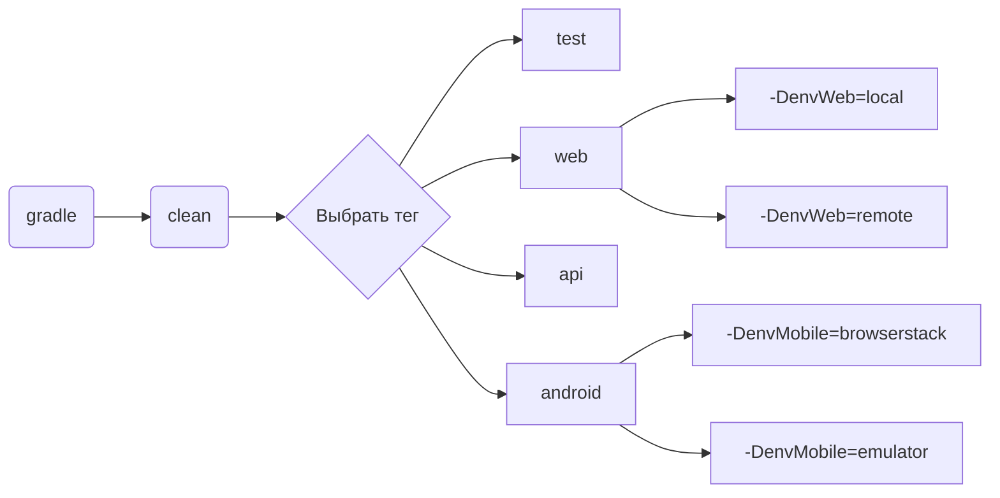
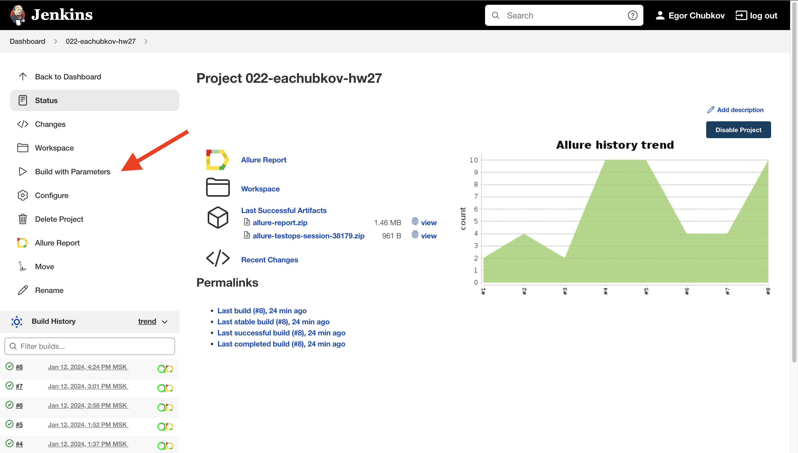
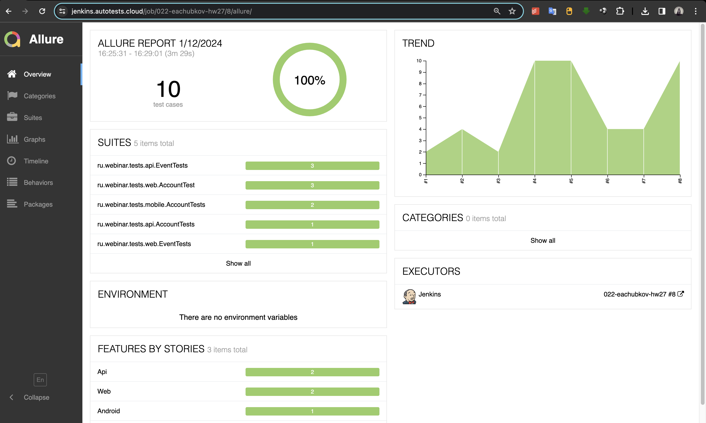
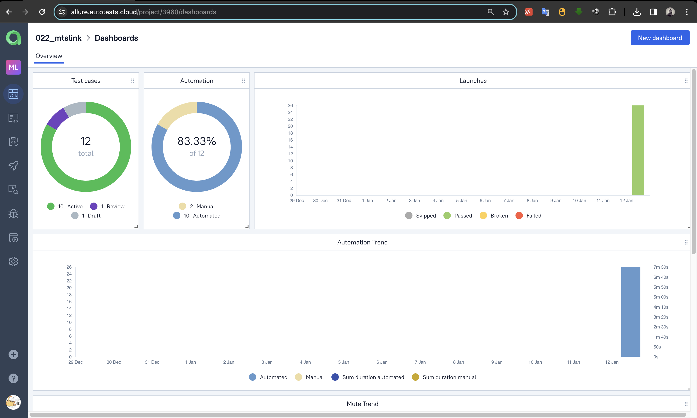
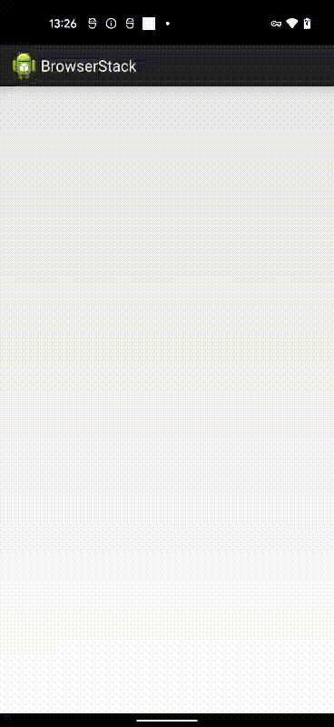

<h1>Проект автоматизации тестирования <a target="_blank" href="https://mts-link.ru/#form"> МТС Линк </a> </h1>

## Описание
МТС Линк (Ранее Webinar) - Российский разработчик платформы для бизнес-коммуникаций и совместной работы. МТС Линк предлагает решения для проведения онлайн-встреч и совещаний, вебинаров, организации смешанного обучения, а также проведения крупных виртуальных и гибридных мероприятий.

**Особенности проекта**:
- `Page Object` шаблон проектирования
- Использование техноголии `Owner` для придания тестам гибкости и легкости конфигурации
- Возможность запуска тестов: локально, удалённо, по тегам
- Использование `Faker` для генерации данных
- Использование `Lombok` для моделей в API тестах
- По итогу прохождения автотестов генерируется `Allure отчет`. Содержание отчета:
    - Шаги теста
    - Скриншот страницы на последнем шаге
    - Исходный код страницы в браузере
    - Логи консоли браузера
    - Видео выполнения автотеста
- Возможность запуска тестов напрямую из `Allure TestOps`
- [ Ожидается ] Интеграция с `Jira`
- [ Ожидается ] Уведомление о результатах прохождения в `Telegram`

## Технологии и инструменты

  

  

  

## Реализованные проверки
### Web
- [x] Авторизация по почте и паролю
- [x] Запуск быстрой встречи
- [x] Изменение информации в профиле
- [x] Выход из аккаунта

### Api
- [x] Авторизация по почте и паролю
- [x] Создание шаблона для мероприятия
- [x] Создание быстрой встречи
- [x] Удаление мероприятия

### Mobile
- [x] Авторизация по почте и паролю
- [x] Выход из аккаунта

# Запуск тестов
Все настройки лежат в папке `resources` в файлах `.properties`.  
При необходимости можно изменить конфигурацию в этих файлах.

### Допустимые комбинации

## Cборка тестов в <b><a target="_blank" href="https://jenkins.autotests.cloud/job/022-eachubkov-hw27/">Jenkins</a></b>

>Для запуска сборки необходимо перейти в раздел `Build with Parameters` и нажать кнопку `Build`

## Интеграция с <b><a target="_blank" href="https://jenkins.autotests.cloud/job/022-eachubkov-hw27/8/allure/">Allure Report</a></b>

## Интеграция с <b><a target="_blank" href="https://allure.autotests.cloud/project/3960/dashboards">Allure TestOps</a></b>

## Пример выполнения теста в Selenoid

> К каждому UI-тесту в отчете прилагается видео

  

## Пример выполнения теста в Browserstack

> К каждому мобильному тесту, выполняемому в Browserstack, в отчете прилагается видео

  

